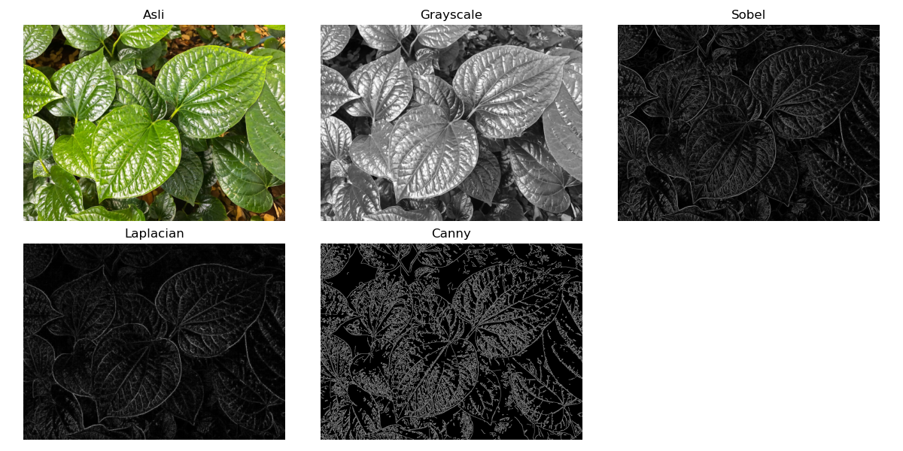

# 🔍 Edge Detection — OpenCV (Python)


---

## Deskripsi Proyek
Proyek ini merupakan tugas mata kuliah **Pengolahan Citra Digital / Computer Vision**  
pada **S2 Teknik Informatika UNPAM**.

Tujuan proyek ini adalah **mendeteksi tepi pada citra digital** menggunakan beberapa metode populer di bidang *image processing*, yaitu:
- **Sobel Operator**
- **Laplacian Operator**
- **Canny Edge Detection**

Hasil deteksi divisualisasikan dalam satu gambar perbandingan untuk memudahkan analisis visual terhadap perbedaan metode.

---

## Contoh Hasil Deteksi Tepi
> Gambar di bawah memperlihatkan hasil deteksi tepi dari citra daun menggunakan metode Sobel, Laplacian, dan Canny.



---

## Teknologi yang Digunakan
- **Python 3.10+**
- **OpenCV (cv2)**
- **NumPy**
- **Matplotlib**

---

## Fitur Utama
1.Konversi gambar ke **grayscale**  
2.Deteksi tepi dengan **Sobel**, **Laplacian**, dan **Canny**  
3.Penyimpanan hasil otomatis ke folder `outputs/`  
4.Visualisasi hasil menggunakan **matplotlib**

---

## Instalasi & Cara Menjalankan

### 1️⃣ Clone repository
```bash
git clone https://github.com/asmadidj/edge-detection.git
cd edge-detection
